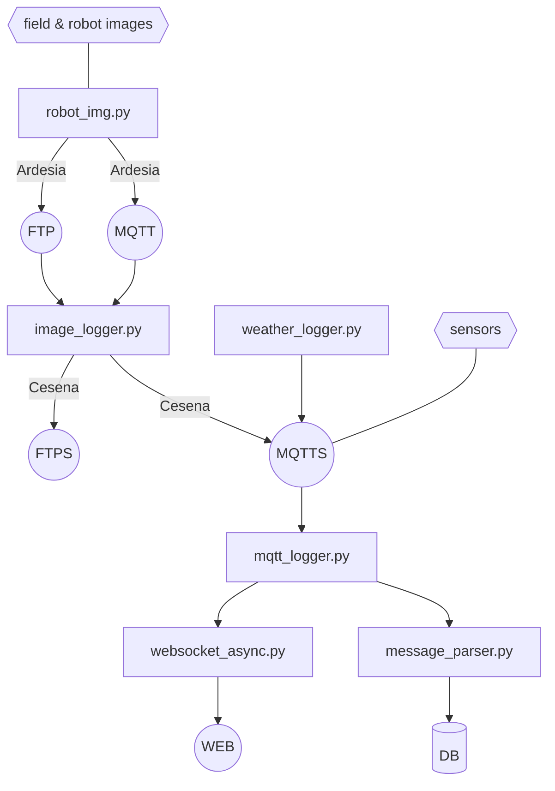
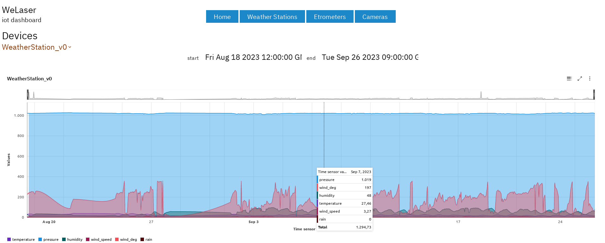
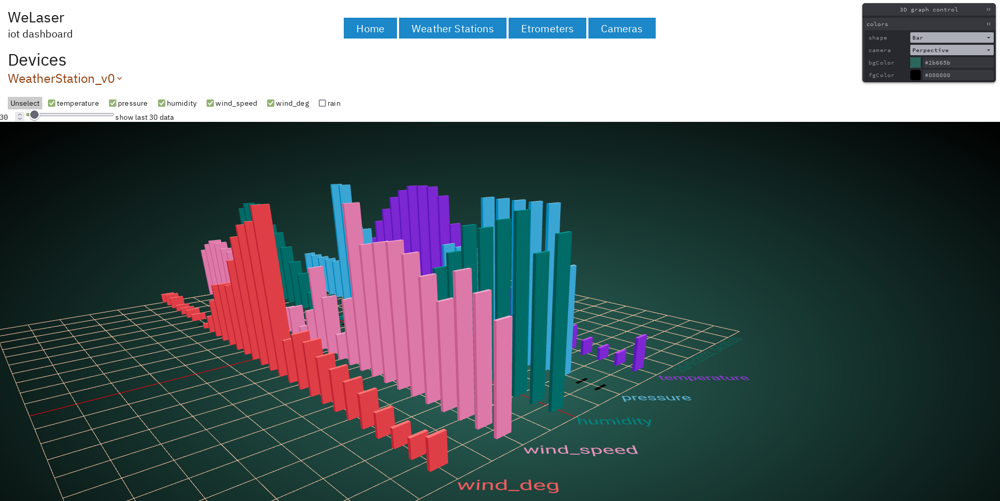
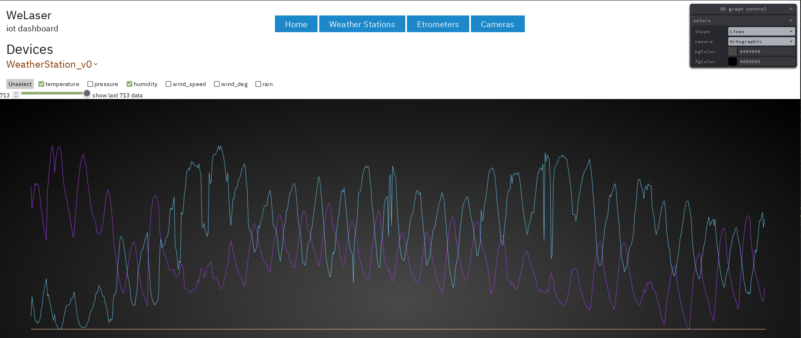
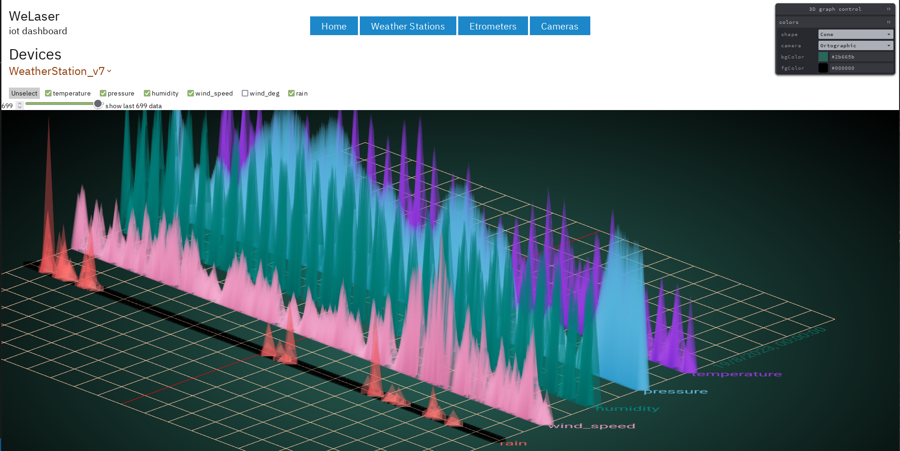

# Documentation for WeLaser's iotbroker 

Iotbroker is part of the server infrastructure for the WeLaser project,

The data acquisition and brokering is made out of several python programs present in the project's root

The data visualization/web is made in Svelte/Sveltekit and is in `svelte-dash/`

## Data acquisition and brokering

As shown in the image, the cameras in the fields and in the robots sends images to Ardesia FTP and MQTT server. 

`image_logger.py` is responsible to log the MQTT messages and resend the images/messages to Cesena FTP's and MQTTS's server. 

Also other devices, like the weather stations, send messages to Cesena MQTTS's server. 

Listening to all the messages is `mqtt_logger.py`that sends websocket event to the web interface (via `websocket_async.py`) and updates the db with `message_parser.py` that is also used to seed the db by the json in `data/`

`message_parser.py` reads json MQTT messages and translate it to a `Prisma` db query. 

`image_logger.py, mqtt_logger.py` and `weather_logger.py` inherits from the base class `AsyncMqttClient` from `mqtt_async.py`that use a custom `async_paho_mqtt_client`

`test_welaser.py` is interactive and used to test the different functionalities

## Data visualization/web 

`image_logger.py` creates `www/images.json` to help Svelte show the new camera images without having to rebuild the website.

`Prisma` javascript client is used for all the web realated queries.

`@carbon/charts` is used for 2D charts and `threlte` for 3D charts

Public facing API are available from the `/api` routes, easing the integration of other web app 

## Installing
Run `pip install -r requirements.txt` for python and `pnpm i ` in the `svelte-dash/` directory

Be sure to have the right .env file with the credentials both in the root folder and in svelte-dash/

Recreate the `www` symbolic link pointing to the static asset directory

Init the db

Generate Prisma client for python and Javascript. 

The async python client is generated by `python3 -m prisma generate` in the active environment. 

The async javascript client can be generated commenting out the right client in the schema present in `prisma/`and running  `npx run generate`from the `svelte-dash/` directory
