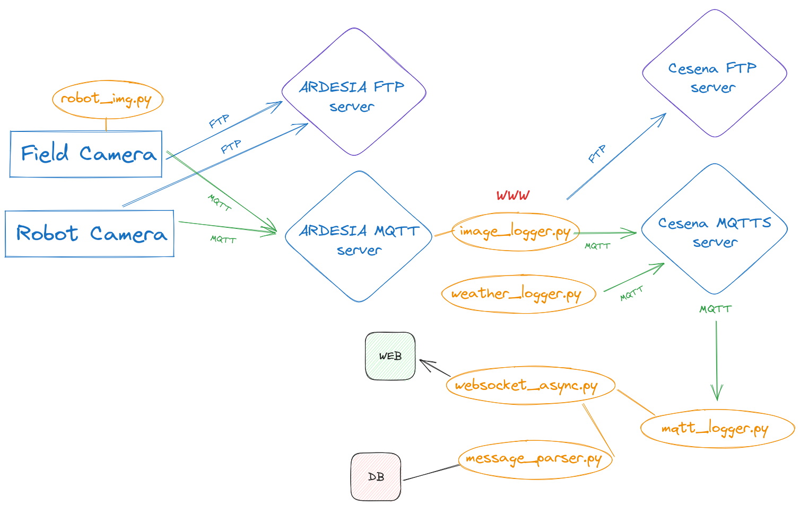

# Documentation for WeLaser's iotbroker 

Iotbroker is part of the server infrastructure for the WeLaser project,
The data acquisition and brokering is made out of several python programs present in the root
The data visualization/web is made in Svelte/Sveltekit and is `svelte-dash/`

## Installing
Be sure to `pip install -r requirements.txt` for python and `pnpm i ` in the `svelte-dash/` directory
Be sure to have the right .env file with the credentials both in root and in svelte-dash/
Recreate the `www` symb link pointing to the static asset directory
Init the db

## Data acquisition and brokering

As shown in the image, the cameras in the fields and in the robots sends images to Ardesia FTP and MQTT server. `image_logger.py` is responsible to log the MQTT messages and resend the images/messages to Cesena FTP's and MQTT's server. 
Also other devices, like the weather stations, send messages to Cesena MQTT's server. 
Listening to all the messages is `mqtt_logger.py`that sends websocket event to the web interface and updates 
the db with `message_parser.py` that can also be used to seed the db using the. json in data/ `message_parser.py` reads an json's MQTT message and translate it to a `Prisma` db query using the async python client generated by `python3 -m prisma generate` in the active enviroment
`image_logger.py, mqtt_logger.py` and `weather_logger.py` inherits from the base class `AsyncMqttClient` from `mqtt_async.py`that use a custom `async_paho_mqtt_client`
`test_welaser.py` is interactive and used to test the different functionalities

## Data visualization/web 

`image_logger.py` creates `www/images.json` to help Svelte show the new images without having to rebuild the website.
`Prisma` javascript client is used for all the web realated queries. It can be generated commenting out the right client in the schema present in `prisma/`and running  `npx run generate`
`@carbon/charts` is used for 2D charts and `threlte` for 3D charts

